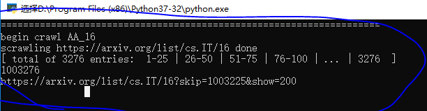
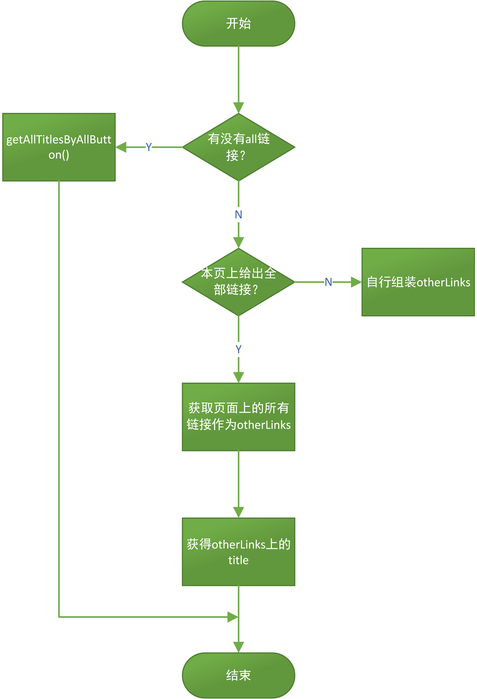

# Crawler-arxiv

arxiv上的论文标题

# 2018.8.27漏洞

https://arxiv.org/list/cs.AI/15		这个网址不能通过翻页来完成

通过页面给出的all链接来获得所有的titles

# 2018.8.28漏洞

当爬取诸如 https://arxiv.org/list/cs.LG/17 的时候，该网站上有5209条记录，所以页面是不提供all按钮的

# 2018.8.29漏洞

漏洞原因：部分网站是最后一页只有一个页码，这样在利用“-”分割之后，会把100和3267粘连在一起

漏洞解决；先利用|分割，在利用-分割

# 爬虫流程图

